# Relatório Consolidado: Análise Estatística Descritiva e Inferencial

> **Documento gerado automaticamente a partir das saídas do notebook:** `Notebooks/analise_descritivas.ipynb`  
> **Controle Metodológico:** Nível Discente (Qui-Quadrado / V de Cramér) e Nível Institucional (Gauss-Markov / ANOVA / Kruskal-Wallis)

---


## FATOR: REGIAO

```text
====================================================================================================
---------------------------------------------- REGIAO ----------------------------------------------
====================================================================================================


ETAPA 01 - ANÁLISE ESTATÍSTICA DESCRITIVA

Tabela 01. Análise Estatística Descritiva
--------------------------------------------------------------------------------------------
REGIAO          N_IFS  TAXA_MEDIA_IF  DESVIO_PADRAO  MEDIANA    MIN    MAX  TAXA_MEDIA_GERAL
--------------------------------------------------------------------------------------------
Sul                 6          59.98          17.37    53.95  41.74  81.57             78.52
Sudeste             9          59.79          14.52    53.69  43.96  80.42             63.44
Norte               7          48.88           5.38    45.73  44.18  57.36             48.95
Centro-Oeste        5          47.23          14.06    45.04  35.05  69.87             41.97
Nordeste           11          42.38           7.38    42.47  30.29  56.39             43.64
--------------------------------------------------------------------------------------------

ETAPA 02. TESTE QUI-QUADRADO E V DE CRAMÉR

Qui-Quadrado Global: χ² = 425,613.86 | p-valor = 0.0000e+00
Tamanho do Efeito Global (V de Cramér): V = 0.3076 -> Associação Forte

Tabela 02. Análise de Contingência para REGIAO (Nível Estudante)
---------------------------------------------------------------------------
REGIAO          CONCLUINTES  RETIDOS  INGRESSANTES  TAXA_MEDIA_GERAL  GRUPO
---------------------------------------------------------------------------
Sul                 2126777   581660       2708437             78.52      a
Sudeste              461347   265925        727272             63.44      b
Norte                 97359   101541        198900             48.95      c
Nordeste             240182   310180        550362             43.64      c
Centro-Oeste         131887   182347        314234             41.97      c
---------------------------------------------------------------------------

ETAPA 03. GRÁFICO DA TAXA MÉDIA GERAL DE CONCLUSÃO POR REGIAO
```

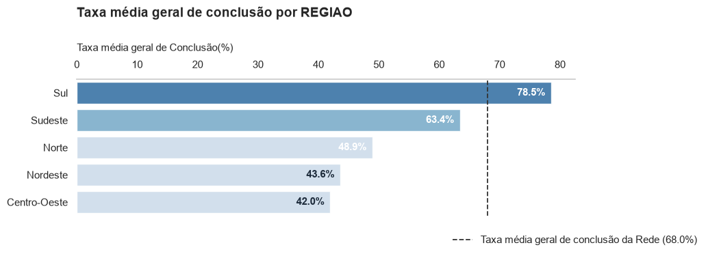

```text
ETAPA 04. VERIFICAÇÃO DOS PRESSUPOSTOS PARA ANOVA (GAUSS-MARKOV)

p-valor Shapiro-Wilk (Normalidade): 6.3632e-02
p-valor Levene (Homocedasticidade): 1.1298e-01

ETAPA 05. ANOVA ONE-WAY (PARAMÉTRICA) PARA REGIAO

ANOVA: F = 3.6793 | p-valor = 1.3863e-02

ETAPA 06. TESTE (TUKEY HSD) DE COMPARAÇÕES DAS TAXAS MÉDIAS DE CONCLUSÃO DOS IFs PARA REGIAO


Tabela 04. Estatística Descritiva Institucional para REGIAO (Nível Instituição)
---------------------------------------------------------------------------------------------------
REGIAO          N_IFS  TAXA_MEDIA_IF  DESVIO_PADRAO  MEDIANA    MIN    MAX  TAXA_MEDIA_GERAL  GRUPO
---------------------------------------------------------------------------------------------------
Sul                 6          59.98          17.37    53.95  41.74  81.57             78.52      a
Sudeste             9          59.79          14.52    53.69  43.96  80.42             63.44      a
Norte               7          48.88           5.38    45.73  44.18  57.36             48.95     ab
Centro-Oeste        5          47.23          14.06    45.04  35.05  69.87             41.97     ab
Nordeste           11          42.38           7.38    42.47  30.29  56.39             43.64      b
---------------------------------------------------------------------------------------------------

ETAPA 07. GRÁFICO DA TAXA MÉDIA DE CONCLUSÃO DOS IFs POR REGIAO
```

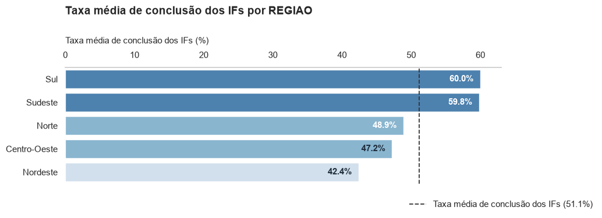

```text
ETAPA 08. GRÁFICO DA DISTRIBUIÇÃO DAS TAXAS MÉDIAS DE CONCLUSÃO DOS IFs POR REGIAO
```

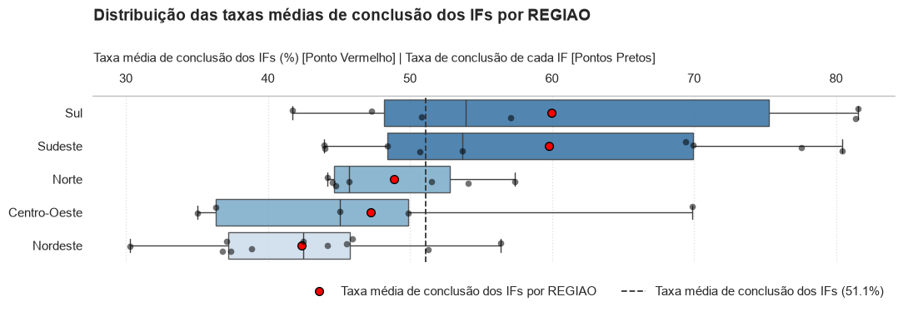


## FATOR: ETNIA

```text
====================================================================================================
----------------------------------------------- ETNIA ----------------------------------------------
====================================================================================================


ETAPA 01 - ANÁLISE ESTATÍSTICA DESCRITIVA

Tabela 01. Análise Estatística Descritiva
-----------------------------------------------------------------------------------------
ETNIA       N_IFS  TAXA_MEDIA_IF  DESVIO_PADRAO  MEDIANA    MIN     MAX  TAXA_MEDIA_GERAL
-----------------------------------------------------------------------------------------
Amarela        38          56.55          17.45    51.31  35.18  105.29             73.02
Branca         38          52.67          13.79    49.50  28.26   81.95             70.45
Parda          38          50.20          14.03    46.03  31.20   87.84             66.02
Indígena       38          48.70          19.21    46.59  27.64   93.55             63.09
Preta          38          47.97          14.38    44.05  27.88   81.73             65.32
-----------------------------------------------------------------------------------------

ETAPA 02. TESTE QUI-QUADRADO E V DE CRAMÉR

Qui-Quadrado Global: χ² = 11,587.98 | p-valor = 0.0000e+00
Tamanho do Efeito Global (V de Cramér): V = 0.0507 -> Associação Residual

Tabela 02. Análise de Contingência para ETNIA (Nível Estudante)
-----------------------------------------------------------------------
ETNIA       CONCLUINTES  RETIDOS  INGRESSANTES  TAXA_MEDIA_GERAL  GRUPO
-----------------------------------------------------------------------
Amarela           46572    17212         63784             73.02      a
Branca          1384876   580965       1965841             70.45      a
Parda           1272810   655016       1927826             66.02      a
Preta            336804   178814        515618             65.32      a
Indígena          16490     9646         26136             63.09      a
-----------------------------------------------------------------------

ETAPA 03. GRÁFICO DA TAXA MÉDIA GERAL DE CONCLUSÃO POR ETNIA
```


```text
ETAPA 04. VERIFICAÇÃO DOS PRESSUPOSTOS PARA ANOVA (GAUSS-MARKOV)

p-valor Shapiro-Wilk (Normalidade): 3.3347e-09
p-valor Levene (Homocedasticidade): 2.7549e-01

ETAPA 05. TESTE DE KRUSKAL-WALLIS (NÃO-PARAMÉTRICO) PARA ETNIA

Kruskal-Wallis: H = 9.5049 | p-valor = 4.9647e-02


ETAPA 06. TESTE (MANN-WHITNEY COM BONFERRONI) DE COMPARAÇÕES DAS TAXAS MÉDIAS POR IFs PARA ETNIA


Tabela 04. Estatística Descritiva Institucional para ETNIA (Nível Instituição)
------------------------------------------------------------------------------------------------
ETNIA       N_IFS  TAXA_MEDIA_IF  DESVIO_PADRAO  MEDIANA    MIN     MAX  TAXA_MEDIA_GERAL  GRUPO
------------------------------------------------------------------------------------------------
Amarela        38          56.55          17.45    51.31  35.18  105.29             73.02      a
Branca         38          52.67          13.79    49.50  28.26   81.95             70.45      a
Parda          38          50.20          14.03    46.03  31.20   87.84             66.02      a
Indígena       38          48.70          19.21    46.59  27.64   93.55             63.09      a
Preta          38          47.97          14.38    44.05  27.88   81.73             65.32      a
------------------------------------------------------------------------------------------------

ETAPA 07. GRÁFICO DA TAXA MÉDIA DE CONCLUSÃO DOS IFs POR ETNIA
```

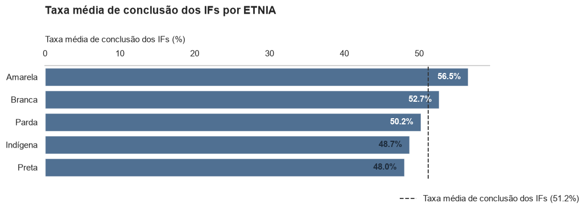

```text
ETAPA 08. GRÁFICO DA DISTRIBUIÇÃO DAS TAXAS MÉDIAS DE CONCLUSÃO DOS IFs POR ETNIA
```

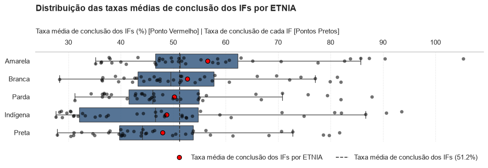


## FATOR: FAIXA_ETARIA

```text
====================================================================================================
------------------------------------------- FAIXA_ETARIA -------------------------------------------
====================================================================================================


ETAPA 01 - ANÁLISE ESTATÍSTICA DESCRITIVA

Tabela 01. Análise Estatística Descritiva
---------------------------------------------------------------------------------------------
FAIXA_ETARIA    N_IFS  TAXA_MEDIA_IF  DESVIO_PADRAO  MEDIANA    MIN     MAX  TAXA_MEDIA_GERAL
---------------------------------------------------------------------------------------------
20 a 24            38          67.77          20.16    64.54  35.46  119.33             73.47
> 60               38          64.38          19.08    63.71  28.57  100.00             82.09
55 a 59            38          61.68          16.90    61.59  30.37   95.13             80.83
50 a 54            38          59.05          16.64    58.48  30.39   89.86             78.83
25 a 29            38          58.88          15.48    55.04  32.06   94.39             73.35
45 a 49            38          54.74          16.81    52.05  24.30   90.08             76.67
40 a 44            38          53.59          15.97    51.54  31.65   89.54             74.91
30 a 34            38          52.30          15.39    49.07  32.39   90.25             72.26
35 a 39            38          51.55          15.56    50.79  27.80   88.77             73.00
< 14               38          41.13          26.36    36.59   1.06   95.37             56.66
15 a 19            38          38.28          13.80    35.24  12.87   72.04             46.67
---------------------------------------------------------------------------------------------

ETAPA 02. TESTE QUI-QUADRADO E V DE CRAMÉR

Qui-Quadrado Global: χ² = 277,139.98 | p-valor = 0.0000e+00
Tamanho do Efeito Global (V de Cramér): V = 0.2482 -> Associação Moderada

Tabela 02. Análise de Contingência para FAIXA_ETARIA (Nível Estudante)
---------------------------------------------------------------------------
FAIXA_ETARIA    CONCLUINTES  RETIDOS  INGRESSANTES  TAXA_MEDIA_GERAL  GRUPO
---------------------------------------------------------------------------
> 60                  47774    10422         58196             82.09      a
55 a 59               68174    16172         84346             80.83      a
50 a 54              116288    31230        147518             78.83      a
45 a 49              185442    56414        241856             76.67      a
40 a 44              265914    89085        354999             74.91     ab
20 a 24              683220   246712        929932             73.47     ab
25 a 29              511991   185977        697968             73.35     ab
35 a 39              323750   119749        443499             73.00     ab
30 a 34              379341   145648        524989             72.26     ab
< 14                   8773     6711         15484             56.66     bc
15 a 19              466885   533533       1000418             46.67      c
---------------------------------------------------------------------------

ETAPA 03. GRÁFICO DA TAXA MÉDIA GERAL DE CONCLUSÃO POR FAIXA_ETARIA
```

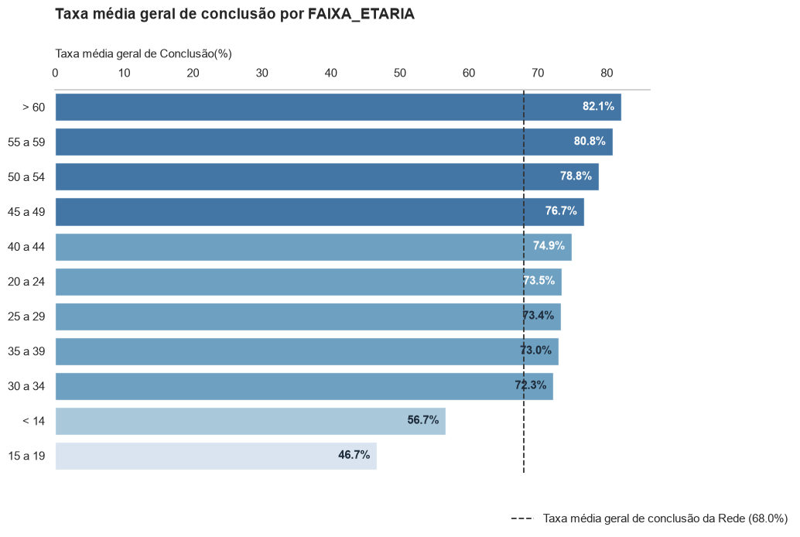

```text
ETAPA 04. VERIFICAÇÃO DOS PRESSUPOSTOS PARA ANOVA (GAUSS-MARKOV)

p-valor Shapiro-Wilk (Normalidade): 3.8478e-07
p-valor Levene (Homocedasticidade): 1.8028e-03

ETAPA 05. TESTE DE KRUSKAL-WALLIS (NÃO-PARAMÉTRICO) PARA FAIXA_ETARIA

Kruskal-Wallis: H = 80.4496 | p-valor = 4.0982e-13


ETAPA 06. TESTE (MANN-WHITNEY COM BONFERRONI) DE COMPARAÇÕES DAS TAXAS MÉDIAS POR IFs PARA FAIXA_ETARIA


Tabela 04. Estatística Descritiva Institucional para FAIXA_ETARIA (Nível Instituição)
----------------------------------------------------------------------------------------------------
FAIXA_ETARIA    N_IFS  TAXA_MEDIA_IF  DESVIO_PADRAO  MEDIANA    MIN     MAX  TAXA_MEDIA_GERAL  GRUPO
----------------------------------------------------------------------------------------------------
20 a 24            38          67.77          20.16    64.54  35.46  119.33             73.47      a
> 60               38          64.38          19.08    63.71  28.57  100.00             82.09     ab
55 a 59            38          61.68          16.90    61.59  30.37   95.13             80.83     ab
50 a 54            38          59.05          16.64    58.48  30.39   89.86             78.83    abc
25 a 29            38          58.88          15.48    55.04  32.06   94.39             73.35    abc
45 a 49            38          54.74          16.81    52.05  24.30   90.08             76.67    abc
40 a 44            38          53.59          15.97    51.54  31.65   89.54             74.91    abc
30 a 34            38          52.30          15.39    49.07  32.39   90.25             72.26     bc
35 a 39            38          51.55          15.56    50.79  27.80   88.77             73.00     bc
< 14               38          41.13          26.36    36.59   1.06   95.37             56.66     cd
15 a 19            38          38.28          13.80    35.24  12.87   72.04             46.67      d
----------------------------------------------------------------------------------------------------

ETAPA 07. GRÁFICO DA TAXA MÉDIA DE CONCLUSÃO DOS IFs POR FAIXA_ETARIA
```

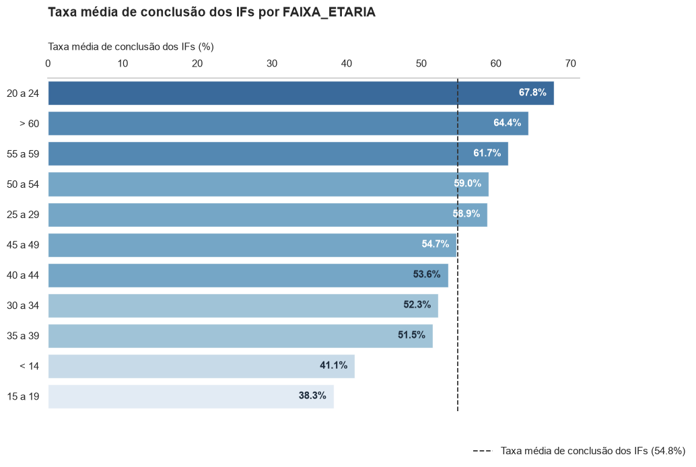

```text
ETAPA 08. GRÁFICO DA DISTRIBUIÇÃO DAS TAXAS MÉDIAS DE CONCLUSÃO DOS IFs POR FAIXA_ETARIA
```

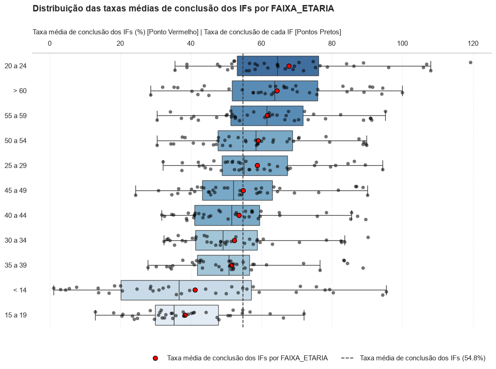


## FATOR: RENDA

```text
====================================================================================================
----------------------------------------------- RENDA ----------------------------------------------
====================================================================================================


ETAPA 01 - ANÁLISE ESTATÍSTICA DESCRITIVA

Tabela 01. Análise Estatística Descritiva
-------------------------------------------------------------------------------------------
RENDA          N_IFS  TAXA_MEDIA_IF  DESVIO_PADRAO  MEDIANA    MIN    MAX  TAXA_MEDIA_GERAL
-------------------------------------------------------------------------------------------
Alta              38          54.63          17.49    51.33  27.97  88.39             75.35
Média-Alta        38          52.94          15.64    49.22  26.95  88.47             74.93
Média             38          51.66          15.16    49.31  29.35  90.28             71.81
Baixa             38          51.56          13.68    47.75  33.54  81.16             66.56
Média-Baixa       38          49.82          15.27    46.91  28.13  87.93             69.71
Muito-Baixa       38          49.18          13.71    45.65  29.39  85.19             58.42
-------------------------------------------------------------------------------------------

ETAPA 02. TESTE QUI-QUADRADO E V DE CRAMÉR

Qui-Quadrado Global: χ² = 64,938.21 | p-valor = 0.0000e+00
Tamanho do Efeito Global (V de Cramér): V = 0.1201 -> Associação Moderada

Tabela 02. Análise de Contingência para RENDA (Nível Estudante)
--------------------------------------------------------------------------
RENDA          CONCLUINTES  RETIDOS  INGRESSANTES  TAXA_MEDIA_GERAL  GRUPO
--------------------------------------------------------------------------
Alta                318891   104321        423212             75.35      a
Média-Alta          277247    92776        370023             74.93      a
Média               535739   210310        746049             71.81      a
Média-Baixa         684157   297290        981447             69.71      a
Baixa               700468   351940       1052408             66.56     ab
Muito-Baixa         541050   385016        926066             58.42      b
--------------------------------------------------------------------------

ETAPA 03. GRÁFICO DA TAXA MÉDIA GERAL DE CONCLUSÃO POR RENDA
```

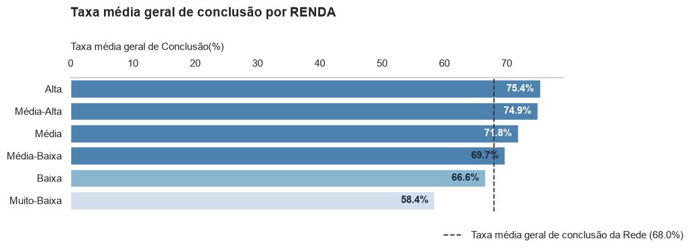

```text
ETAPA 04. VERIFICAÇÃO DOS PRESSUPOSTOS PARA ANOVA (GAUSS-MARKOV)

p-valor Shapiro-Wilk (Normalidade): 3.4716e-08
p-valor Levene (Homocedasticidade): 6.2395e-01

ETAPA 05. TESTE DE KRUSKAL-WALLIS (NÃO-PARAMÉTRICO) PARA RENDA

Kruskal-Wallis: H = 3.3903 | p-valor = 6.4005e-01

Não há diferença estatisticamente significante entre as medianas institucionais de RENDA (p >= 0.05).

Tabela 04. Estatística Descritiva Institucional para RENDA (Nível Instituição)
--------------------------------------------------------------------------------------------------
RENDA          N_IFS  TAXA_MEDIA_IF  DESVIO_PADRAO  MEDIANA    MIN    MAX  TAXA_MEDIA_GERAL  GRUPO
--------------------------------------------------------------------------------------------------
Alta              38          54.63          17.49    51.33  27.97  88.39             75.35      a
Média-Alta        38          52.94          15.64    49.22  26.95  88.47             74.93      a
Média             38          51.66          15.16    49.31  29.35  90.28             71.81      a
Baixa             38          51.56          13.68    47.75  33.54  81.16             66.56      a
Média-Baixa       38          49.82          15.27    46.91  28.13  87.93             69.71      a
Muito-Baixa       38          49.18          13.71    45.65  29.39  85.19             58.42      a
--------------------------------------------------------------------------------------------------

ETAPA 07. GRÁFICO DA TAXA MÉDIA DE CONCLUSÃO DOS IFs POR RENDA
```

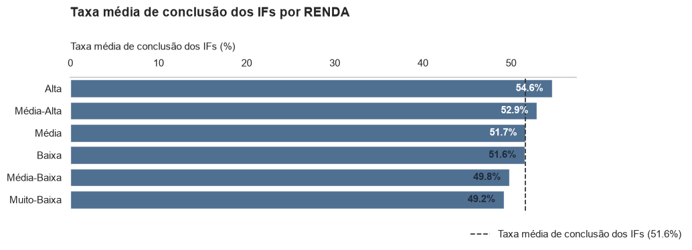

```text
ETAPA 08. GRÁFICO DA DISTRIBUIÇÃO DAS TAXAS MÉDIAS DE CONCLUSÃO DOS IFs POR RENDA
```

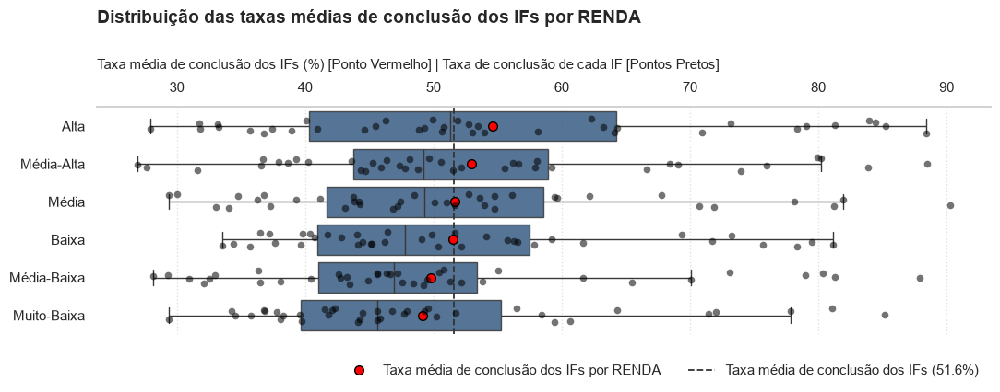


## FATOR: SEXO

```text
====================================================================================================
----------------------------------------------- SEXO -----------------------------------------------
====================================================================================================


ETAPA 01 - ANÁLISE ESTATÍSTICA DESCRITIVA

Tabela 01. Análise Estatística Descritiva
-----------------------------------------------------------------------------------------
SEXO         N_IFS  TAXA_MEDIA_IF  DESVIO_PADRAO  MEDIANA    MIN    MAX  TAXA_MEDIA_GERAL
-----------------------------------------------------------------------------------------
Feminino        38          53.26          13.38    50.32  32.95  82.35             69.77
Masculino       38          48.60          13.78    43.92  28.05  82.30             65.47
-----------------------------------------------------------------------------------------

ETAPA 02. TESTE QUI-QUADRADO E V DE CRAMÉR

Qui-Quadrado Global: χ² = 9,327.91 | p-valor = 0.0000e+00
Tamanho do Efeito Global (V de Cramér): V = 0.0455 -> Associação Residual

Tabela 02. Análise de Contingência para SEXO (Nível Estudante)
------------------------------------------------------------------------
SEXO         CONCLUINTES  RETIDOS  INGRESSANTES  TAXA_MEDIA_GERAL  GRUPO
------------------------------------------------------------------------
Feminino         1817868   787685       2605553             69.77      a
Masculino        1239684   653968       1893652             65.47      b
------------------------------------------------------------------------

ETAPA 03. GRÁFICO DA TAXA MÉDIA GERAL DE CONCLUSÃO POR SEXO
```

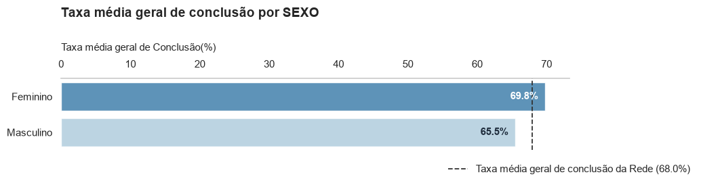

```text
ETAPA 04. VERIFICAÇÃO DOS PRESSUPOSTOS PARA ANOVA (GAUSS-MARKOV)

p-valor Shapiro-Wilk (Normalidade): 1.1455e-05
p-valor Levene (Homocedasticidade): 9.5627e-01

ETAPA 05. TESTE DE KRUSKAL-WALLIS (NÃO-PARAMÉTRICO) PARA SEXO

Kruskal-Wallis: H = 3.8961 | p-valor = 4.8398e-02

Como SEXO possui apenas 2 categorias, o teste global já compara diretamente ambos os grupos.

Tabela 04. Estatística Descritiva Institucional para SEXO (Nível Instituição)
------------------------------------------------------------------------------------------------
SEXO         N_IFS  TAXA_MEDIA_IF  DESVIO_PADRAO  MEDIANA    MIN    MAX  TAXA_MEDIA_GERAL  GRUPO
------------------------------------------------------------------------------------------------
Feminino        38          53.26          13.38    50.32  32.95  82.35             69.77      a
Masculino       38          48.60          13.78    43.92  28.05  82.30             65.47      b
------------------------------------------------------------------------------------------------

ETAPA 07. GRÁFICO DA TAXA MÉDIA DE CONCLUSÃO DOS IFs POR SEXO
```

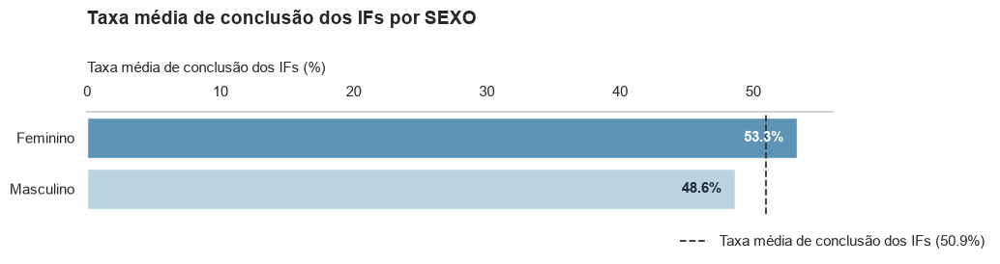

```text
ETAPA 08. GRÁFICO DA DISTRIBUIÇÃO DAS TAXAS MÉDIAS DE CONCLUSÃO DOS IFs POR SEXO
```

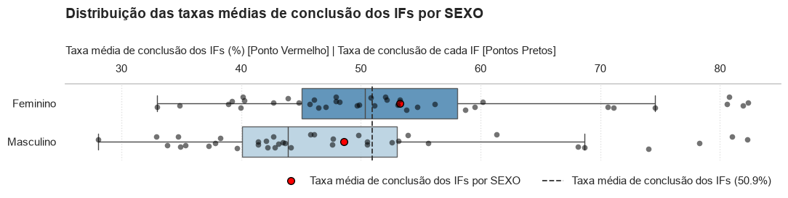
